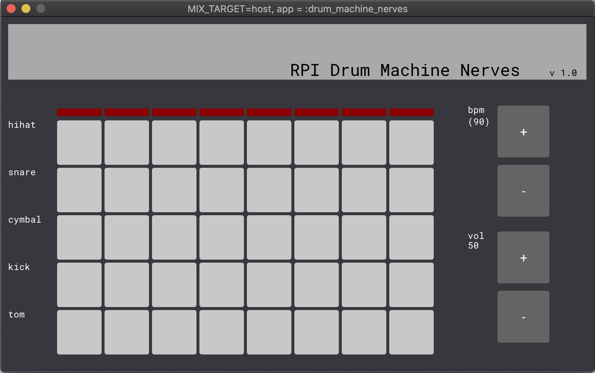
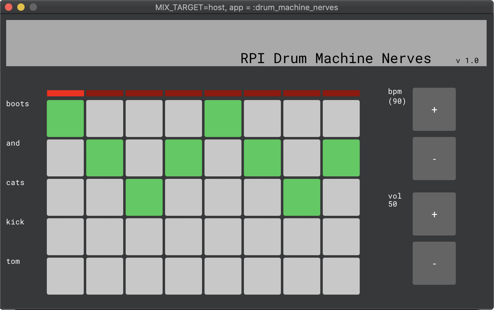
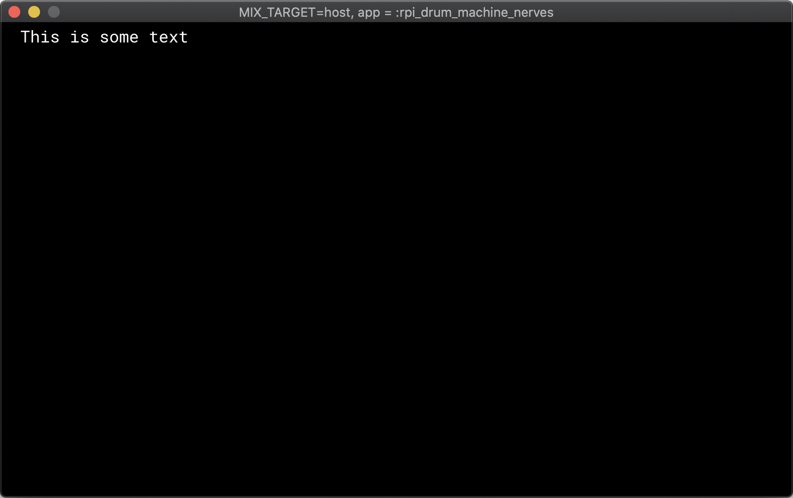
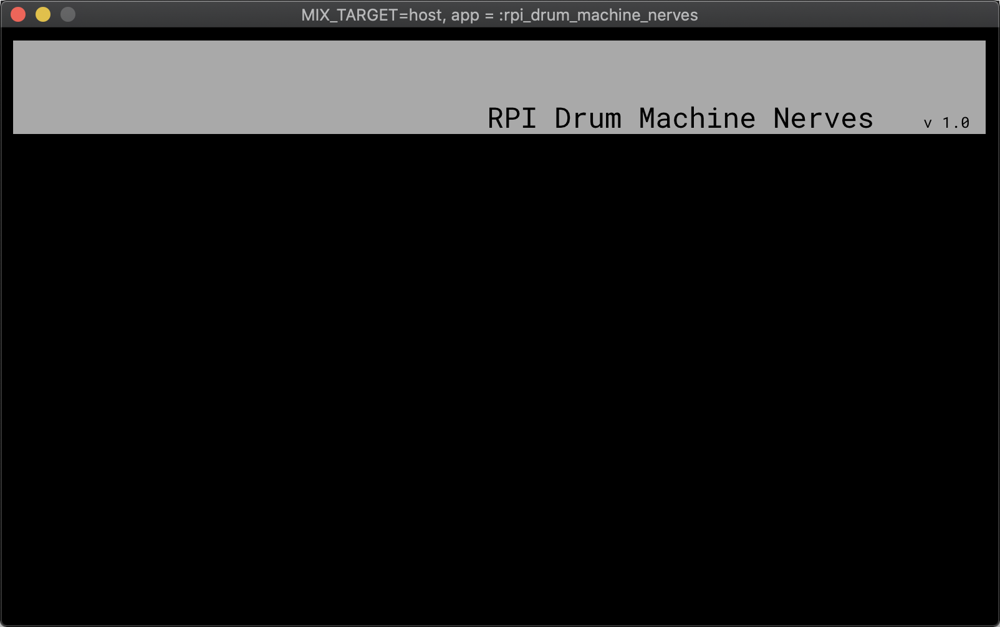
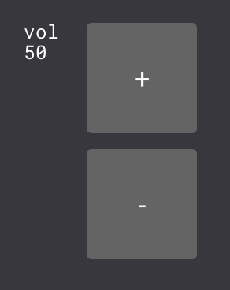
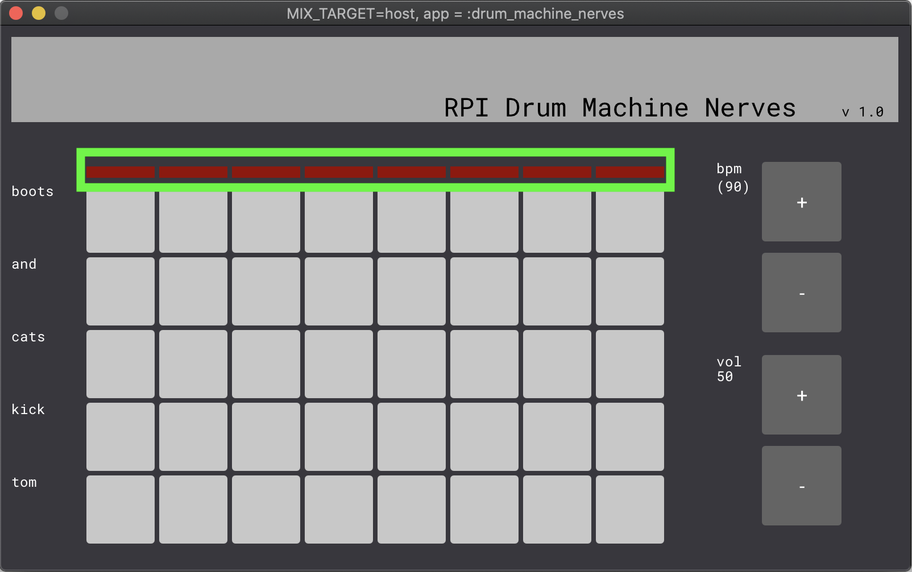
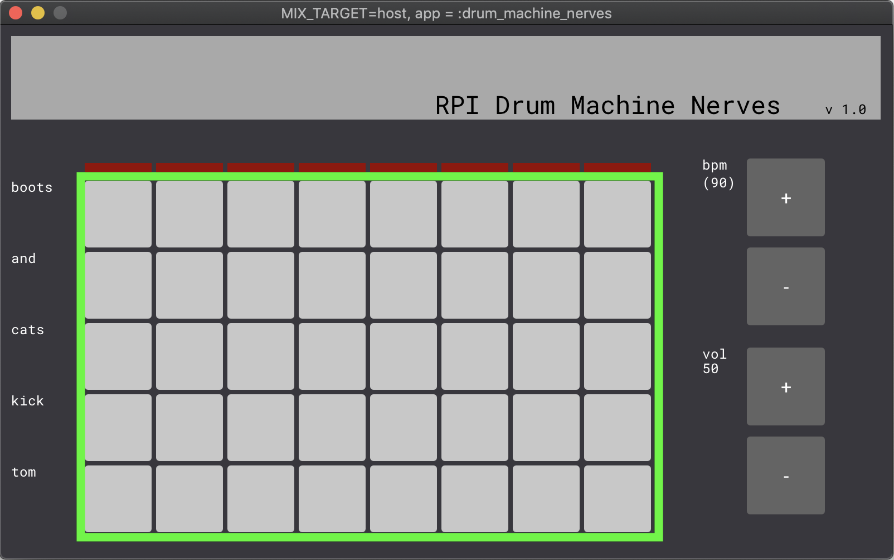
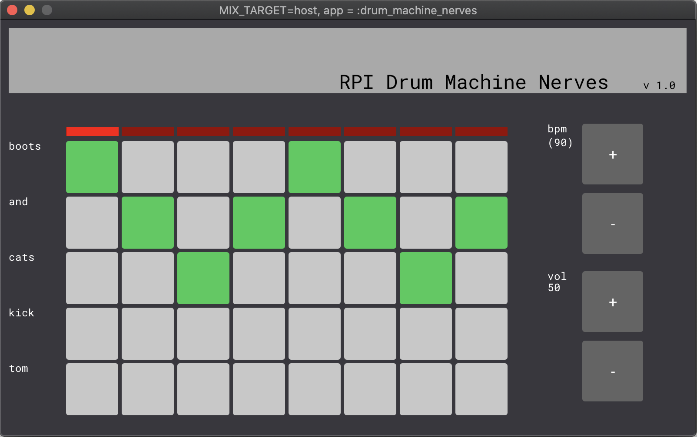

## How to Build a Touch-Screen Drum Machine with Nerves

#### Hassan Khan-Shaikley

<small>
Twitter: @hassanshaikley &nbsp;
Github: @hassanshaikley
</small>

---

### Software Engineer @ Community.com

We're hiring!
---

## Me

- Spouse
- Plants
- Food
- Games
- Pets
- Community


---

## Drum Machine ?

- What
- Why 
- How

---

## What is a Drum Machine

Drum is hard, button is easy

---


"My heart's beating like an 808" - Britney Spears

---

<!-- --- -->


♫ I wanna dance with somebody ♫ 

♫ When I get that feeling ♫ 

♫ So keep your love lockdown ♫

♫ I love the way you move ♫

♫ Music makes you lose control ♫ 

♫ Beat it ♫


---



---



---

## Hardware


---


---

## Software

- Scenic
- fluidsynth ?


---

## Meatware

- Yourself

---

## Getting Started

- Getting Started With Nerves in Scenic docs
- Plug and play

---


---


## Primitives & Components

#### Primitives

- Text
- Rectangle 
- Image
- etc...


#### Components

- Button
- Slider
- Drop Down
- etc...

---
## Graph

```elixir
@graph Scenic.Graph.build()
|> text("This is some text", translate: {20, 20})
```




---

## Header



---

## Scenic UI Example 1/4




---

## Scenic UI Example 2/4

```elixir
    button(graph, "-",
      theme: %{...} # map containing the style
      id: :volume_down, # id, like an html id
      t: {40, 70}, # The position
      height: 70,
      width: 70
    )
```
---

## Scenic UI Example 3/4

```elixir
def init(_, _opts) do
  state = %{
    graph: @graph
  }

  {:ok, state, push: state.graph}
end
```

---

## Scenic UI Example 4/4

```elixir
root_graph
|> VolumeControls.add_to_graph()
```

---

## Beat Indicator




---

## Control Panel





---

## Bread & Butter 1/2

The loop.

  - Process.send_after(self(), :loop, next_loop_milliseconds)
  - Play active audio
  - Let other components know a loop occured so they can update their UI
  

---

## Bread & Butter 2/2

Microtimer

---
## Events & Communicating between components 1/2

- Component is a specialized Scene
- Scene is a specialized Genserver
---

## Events & Communicating between components 2/2




---
## Optimize CPU usage 1/5

Benchee

```
...

Name                  ips        average  deviation         median         99th %
flat_map           2.34 K      426.84 μs     ±9.88%      418.72 μs      720.20 μs
map.flatten        1.18 K      844.08 μs    ±19.73%      778.10 μs     1314.87 μs

Comparison:
flat_map           2.34 K
map.flatten        1.18 K - 👉 1.98x slower +417.24 μs 👈

Memory usage statistics:

Name           Memory usage
flat_map          624.97 KB
map.flatten       781.25 KB - 👉 1.25x memory usage +156.28 KB 👈
```

---

## Optimize CPU usage 2/5

Follow best practices

- a <> b is faster than "#{a}#{b} 
- === barely faster than ==

---

## Optimize CPU usage 3/5
- ets vs genserver state

---

## Optimize CPU usage 4/5

- Cache pure functions at compile time by generating function heads that return the precalculated value
  - Top 2x faster, 0 mem usage vs 64B
```elixir
  for n <- 0..100 do
      @str "volume is #{n}"
      def volume_string(unquote(n)) do
        @str
      end
  end
```
vs
```elixir
  def volume_string(n) do
    "volume is #{n}"
  end
```
Thank you Bryan Joseph for helping me accomplish this

---

```elixir
    for n <- 0..100 do
        @str "volume is #{n}"
        def volume_string(unquote(n)) do
          @str
        end
    end
```
☝️ Generates👇
```elixir
    def volume_string(0) do
      "volume is 0"
    end
    def volume_string(1) do
      "volume is 1"
    end
    def volume_string(2) do
      "volume is 2"
    end
    ...
    def volume_string(100) do
      "volume is 100"
    end
```
And ☝️ is 2-3x faster than 👇
```elixir
    def volume_string(n), do: "volume is #{n}"
```
and
```elixir
    def volume_string(n), do: "volume is " <> to_string(n)
```
---

## Optimize CPU usage 5/5

- nifs


"With great power comes great responsibility" - Uncle Ben, Spider-Man (2002)

---

## Optimize power consumption

- Better power supply
  - I use a 5.2V / 3A
- Disable what you don't need
	- ethernet
	- leds
	- usbs
	- https://github.com/cjfreeze/power_control is a great library for this

---

# Potential improvements

- Robotic arms
- More accurate timing 
  - mix new beats talk by Mat Trudel explores this
- fluidysynth & fhunleth/midi_synth

---

# In Conclusion

It's not just possible to make an amazing drum machine with Nerves, it's a great tool for the job.

---

## Questions

source: github.com/hassanshaikley/rpi-drum-machine-nerves


