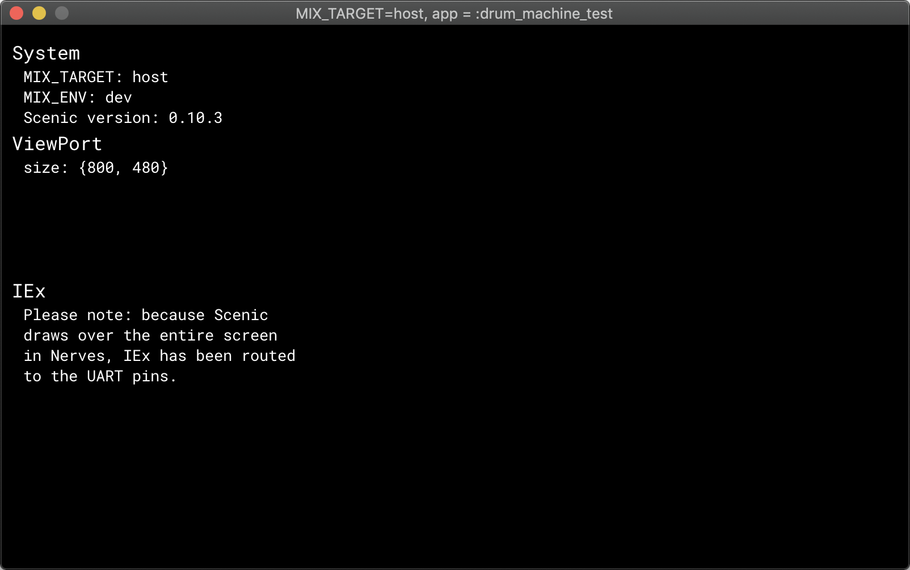

## How to Build a Touch-Screen Drum Machine with Nerves

#### Hassan Khan-Shaikley

<small>
Twitter: @hassanshaikley &nbsp;
Github: @hassanshaikley
</small>

---

### Software Engineer @ Community.com

We're hiring!
---

## Me

- Spouse
- Plants
- Food
- Games
- Pets
- Community


---

## Drum Machine ?

- What
- Why 
- How

---

## What is a Drum Machine

Drum is hard, button is easy

---


"My heart's beating like an 808" - Britney Spears

---

<!-- --- -->


♫ I wanna dance with somebody ♫ 

♫ When I get that feeling ♫ 

♫ So keep your love lockdown ♫

♫ I love the way you move ♫

♫ Music makes you lose control ♫ 

♫ Beat it ♫


---


---


---

## Hardware

- RPI3
- Official 7" Touchscreen
- Audio Jack Mic
- Power Supply
	- 5.25V / 3A 
- Micro SD Card

---


---

## Software

- Nerves
	- aplay (ships with nerves), afplay (local to mac)
- Scenic
	- Supports cross platform compilation of UI
	- Has an RPI Driver

---

## Meatware

- Yourself

---

## Getting Started

- Getting Started With Nerves in Scenic docs
- Plug and play

---

## Initializing the project


0. Plug in your SD card
1. `mix scenic.new.nerves rpi_drum_machine_nerves`
2. `cd rpi_drum_machine_nerves`
3. `export MIX_TARGET=rpi3`
4. `mix deps.get`
5. `NERVES_SYSTEM=rpi3 mix firmware.burn`


---



---


## Sound output to jack

```bash
amixer cset numid=3 1
```
☝️ terminal command, 👇 Elixir equivalent
```elixir
System.cmd("amixer", ["cset", "numid=3", "1"])
```
- 0: automatic
- 1: analog (headphone jack)
- 2: HDMI
- 3: None 

---

## Changing volume

```bash
amixer cset numid=1 #{percent}%
```
☝️ terminal command, 👇 Elixir equivalent
```
System.cmd("amixer", ["cset", "numid=3", "#{percent}%"])`
```

---

## Using static assets

put wav files in `priv/static` 
accessible at
```elixir
priv_dir = :code.priv_dir(:rpi_drum_machine_nerves)
Path.join(priv_dir, "static")`
```

---

## Playing an audio file

```bash
aplay -q path/to/audio/file.wav
```

☝️ terminal command, 👇 Elixir equivalent

```elixir
System.cmd("aplay", ["-q", path_to_audio_file])
```


---
## Primitives & Components

#### Primitives

- Text
- Rectangle 
- Image
- etc...


#### Components

- Button
- Slider
- Drop Down
- etc...

---
## Graph

```elixir
@graph Scenic.Graph.build()
|> text("This is some text", translate: {20, 20})
```


---

## Scenic UI Example 1/4


---

## Scenic UI Example 2/4

```elixir
    button(graph, "-",
      theme: %{
        text: :white,
        background: {100, 100, 100}, # rgb 100, 100, 100
        active: {100, 200, 100}, # rgb 100, 200, 100 when pressed
        border: :black
      },
      id: :volume_down, # id, like an html id
      t: {40, 70}, # The position
      height: 70,
      width: 70
    )
```
---

## Scenic UI Example 3/4

```elixir
def init(_, _opts) do
  state = %{
    graph: @graph
  }

  {:ok, state, push: state.graph}
end
```

---

## Scenic UI Example 4/4

```elixir
root_graph
|> VolumeControls.add_to_graph()
```

---

## Events & Communicating between components 1/4

```elixir
 def child_spec({args, opts}) do
   # name allows us to communicate via the name
   start_opts = [__MODULE__, args, Keyword.put_new(opts, :name, __MODULE__)]
   %{
     id: make_ref(),
     # important bit 👇
     start:
       {Scenic.Scene, :start_link, start_opts},
     type: :worker,
     restart: :permanent,
     shutdown: 500
   }
 end
```
---

## Events & Communicating between components 2/4

```elixir
def filter_event({:click, element_id}, _context, state) do

end
```
---

## Events & Communicating between components 3/4

In the root component where we want to send messages

```elixir
  alias RpiDrumMachineNerves.Components.VolumeControls
  ...
  def filter_event({:click, :volume_down}, _context, state) do
    new_volume = decrease_volume(state.volume)
    GenServer.cast(VolumeControls, {:update_volume, new_volume})
    new_state = Map.put(state, :volume, new_volume)
    {:noreply, new_state}
  end
```
---

## Events & Communicating between components 4/4

In the component we want to receive messages from

```elixir
def handle_cast({:update_volume, new_volume}, state) do
  vol = Integer.to_string(new_volume)
  graph = Graph.modify(state.graph, :volume_label, &text(&1, vol))
  {:noreply, state, push: graph}
end
```

---

## Bread & Butter 1/5

```elixir
# List of tuples of {translation_x, translation_y, {x, y} = _id}
@buttons Enum.map(0..(@num_cols - 1), fn x ->
            Enum.map(0..(@num_rows - 1), fn y ->
              {
                (@width + @padding) * x, 
                (@height + @padding) * y,
                {x, y}
              }
            end)
          end)
          |> List.flatten()
```

---

## Bread & Butter 2/5
```elixir
  @graph Graph.build()
    |> group(
      fn graph ->
        Enum.reduce(
          @buttons,
          graph,
          fn obj, graph ->
            graph
            |> push_button.(obj, :up)
            |> push_button.(obj, :down)
          end
        )
      end,
      t: {16 + 60, 140}
    )
```

---

## Bread & Butter 3/5

```elixir
  def filter_event({:click, {_col, _row, direction} = id} = event, _context, state) do
    graph = toggle_button(id, direction, state.graph)
    state = Map.put(state, :graph, graph)
    {:cont, event, state, push: graph}
  end
```
---
## Bread & Butter 4/5
 
```elixir
def init(_, _) do
  Process.send_after(self(), :loop, 5000, [])
  state =
    %{ graph: graph,
      bpm: 90,
      beat_length_in_ms: bpm_to_ms(90),
      volume: 50,
      iteration: 0
    }
    ...
end
```


---

## Bread & Butter 5/5

```elixir
  def handle_info(:loop, %{iteration: iteration, beat_length_in_ms: beat_length_in_ms} = state) do
    Process.send_after(self(), :loop, beat_length_in_ms)
    GenServer.cast(StepIndicator, {:loop, iteration})
    play_active_sounds_for_iteration(iteration)
    new_state = Map.put(state, :iteration,  rem(iteration + 1, 8))
    {:noreply, new_state}
  end
```

---

## Optimize CPU usage 1/6

- Benchee

```
...

Name                  ips        average  deviation         median         99th %
flat_map           2.34 K      426.84 μs     ±9.88%      418.72 μs      720.20 μs
map.flatten        1.18 K      844.08 μs    ±19.73%      778.10 μs     1314.87 μs

Comparison:
flat_map           2.34 K
map.flatten        1.18 K - 1.98x slower +417.24 μs

Memory usage statistics:

Name           Memory usage
flat_map          624.97 KB
map.flatten       781.25 KB - 1.25x memory usage +156.28 KB
```

---

## Optimize CPU usage 2/6

- Follow performance best practices
	- ie: Matching atoms is faster than strings
		- use atom id's
	- a <> b is faster than "#{a}#{b} 
		- Matching is faster than <>
	- === barely faster than ==

---

## Optimize CPU usage 3/6
- Tried using ETS but it wasn't fast enough; there are some optimizations I still need to try

---

## Optimize CPU usage 4/6

- Leverage the 4 cores on the rpi3

---

## Optimize CPU usage 5/6

- Cache pure functions at compile time by generating function heads that return the precalculated value
  - Top 2x faster, 0 mem usage vs 64B
```elixir
  for n <- 0..100 do
      @str "n is #{n}"
      def volume_string(unquote(n)) do
        @str
      end
  end
```
vs
```elixir
  def volume_string(n) do
    "n is #{n}"
  end
```
Thank you Bryan Joseph for helping me accomplish this

---

```elixir
    for n <- 0..100 do
        @str "n is #{n}"
        def volume_string(unquote(n)) do
          @str
        end
    end
```
☝️ Generates👇
```elixir
    def volume_string(0) do
      "n is 0"
    end
    def volume_string(0) do
      "n is 1"
    end
    def volume_string(0) do
      "n is 2"
    end
    ...
    def volume_string(0) do
      "n is 3"
    end
```
And ☝️ is 2-3x faster than 👇
```elixir
    def volume_string(n), do: "n is #{n}"

    def volume_string(n), do: "n is " <> to_string(n)
```
---

## Optimize CPU usage 6/6

- nifs


---

## Optimize power consumption

- Better power supply
  - I use a 5.2V / 3A
- Disable what you don't need
	- ethernet
	- leds
	- usbs
	- https://github.com/cjfreeze/power_control is a great library for this

---

## Don't optimize memory

- Leverage memory to decrease CPU usage where you can
  - RPI3A's have 512mb
  - RPI3B's have 1GB

---

# Potential improvements

- Robotic arms
- More accurate timing 
  - mix new beats talk by Mat Trudel explores this
- fluidysynth & fhunleth/midi_synth

---

# In Conclusion

It's not just possible to make an amazing drum machine with Nerves, it's a great tool for the job.

---

## Questions

source: github.com/hassanshaikley/rpi-drum-machine-nerves


