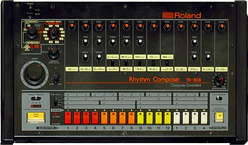
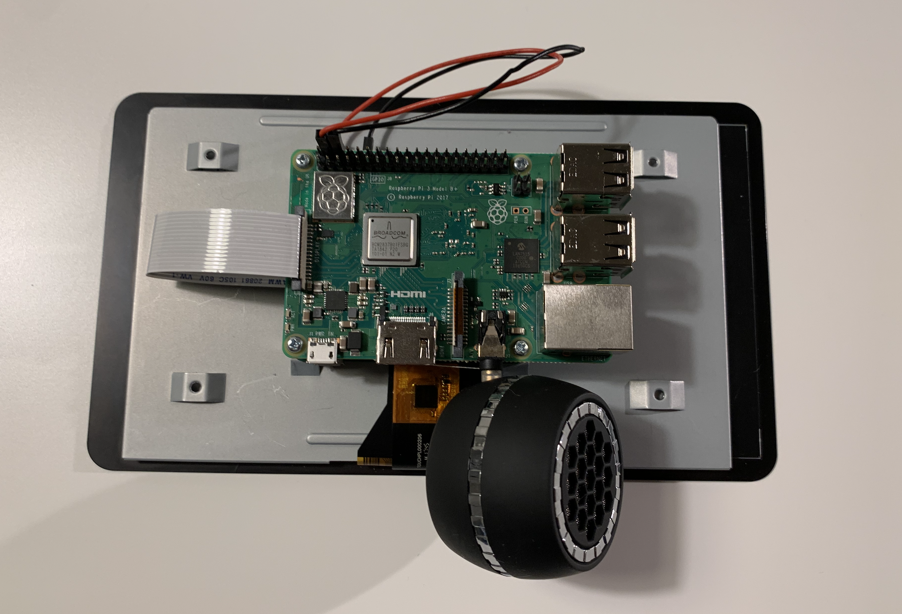

# How to Build a Drum Machine with Nerves

### Hassan Khan-Shaikley

Twitter: @hassanshaikley

Github: @hassanshaikley

---

## Me

- spouse
- plants
- food
- tea
- games
- pets

---

## What is a Drum Machine

<!--  -->


---

## Hardware

- RPI3
- Official 7" Touchscreen
- Audio Jack Mic
- Power Supply
	- 5.25V / 3A 
- Micro SD Card

---



---

## Software

- Nerves
	- aplay (ships with nerves), afplay (local to mac)
- Scenic
	- Supports cross platform compilation of UI
	- Has an RPI Driver

---

## Meatware

- Yourself

---

## Getting Started

- Getting Started With Nerves in Scenic docs
- Plug and play

---

## Initializing the project

0. Plug in your SD card
1. `mix scenic.new.nerves rpi_drum_machine_nerves`
2. `cd rpi_drum_machine_nerves`
3. `export MIX_TARGET=rpi3`
4. `mix deps.get`
5. `NERVES_SYSTEM=rpi3 mix firmware.burn` 

---


---

## Sound output to jack

`amixer cset numid=3 1'`

`System.cmd("amixer", ["cset", "numid=3", "1"])`
- 0: automatic
- 1: analog (headphone jack)
- 2: HDMI
- 3: None 

---

## Changing volume

`amixer cset numid=1 #{percent}%`

`System.cmd("amixer", ["cset", "numid=3", "#{percent}%"])`

---

## Using static assets

put wav files in `priv/static` 
accessible at
```
priv_dir = :code.priv_dir(:rpi_drum_machine_nerves)
Path.join(priv_dir, "static")`
```

---

## Playing an audio file

`aplay -q #{path_to_audio_file}`

or

`System.cmd("aplay", ["-q", path_to_audio_file])`
---
## Scenic UI Example 1/3

```
  @graph Graph.build(font: :roboto_mono, font_size: 16)
         |> group(
           fn graph ->
             graph
             |> button("-",
               theme: %{
                 text: :white,
                 background: {100, 100, 100},
                 active: {100, 200, 100},
                 border: :black
               },
               id: :volume_down,
               t: {40, -10 + 80},
               height: 70,
               width: 70
             )
           end,
           t: {630, 300}
         )
```
---

## Scenic UI Example 2/3

```

def init(_, _opts) do
  state = %{
    graph: @graph
  }

  {:ok, state, push: state.graph}
end

```

---

## Scenic UI Example 3/3

```
root_graph
|> VolumeControls.add_to_graph()
```


---

## Events & Communicating between components 1/3

```
 def child_spec({args, opts}) do
   # name allows us to communicate via the name
   start_opts = [__MODULE__, args, Keyword.put_new(opts, :name, __MODULE__)]
   %{
     id: make_ref(),
     # important bit 👇
     start:
       {Scenic.Scene, :start_link, start_opts},
     type: :worker,
     restart: :permanent,
     shutdown: 500
   }
 end
```

---

## Events & Communicating between components 2/3

In the root component where we want to send messages

```
  alias RpiDrumMachineNerves.Components.VolumeControls
  ...
  def filter_event({:click, :volume_down}, _context, state) do
    new_state = decrease_volume(state)
    GenServer.cast(VolumeControls, {:update_volume, new_state.volume})
    {:noreply, new_state}
  end
```
---

## Events & Communicating between components 3/3

In the component we want to receive messages from

```
def handle_cast({:update_volume, new_volume}, state) do
  vol = Integer.to_string(new_volume)
  graph = Graph.modify(state.graph, :volume_label, &text(&1, vol))
  {:noreply, state, push: graph}
end
```

---

## Optimize CPU usage 1/4

- Benchee
- Follow performance best practices
	- ie: Matching atoms is faster than strings
		- use atom id's
	- a <> b 3x faster than "#{a}#{b} 
		- Matching is 3x faster than <>
	- === barely faster than ==

---

## Optimize CPU usage 2/4
- Tried using ETS but it wasn't fast enough; there are some optimizations I still need to try
- Leverage the 4 cores on the rpi3

---

## Optimize CPU usage 3/4
- Cache pure functions at compile time by generating function heads that return the precalculated value
  - Top 2x faster, 0 mem usage vs 64B
```
  for n <- 0..100 do
      @str "n is #{n}"
      def volume_string(unquote(n)) do
        @str
      end
  end
```
vs
```
  def volume_string(n) do
    "n is #{n}"
  end
```
Thank you Bryan Joseph for helping me accomplish this

---
## Optimize CPU usage 4/4

- nifs


---

## Optimize power consumption

- Disable what you don't need
	- ethernet
	- leds
	- usbs
	- https://github.com/cjfreeze/power_control is a great library for this

---

## Don't optimize memory

- Leverage memory to decrease CPU usage where you can
  - RPI3A's have 512mb
  - RPI3B's have 1GB

---

# Potential improvements

- Robotic arms
- More accurate timing 
  - mix new beats talk by Mat Trudel explores this

---

## Questions

source: github.com/hassanshaikley/rpi-drum-machine-nerves


