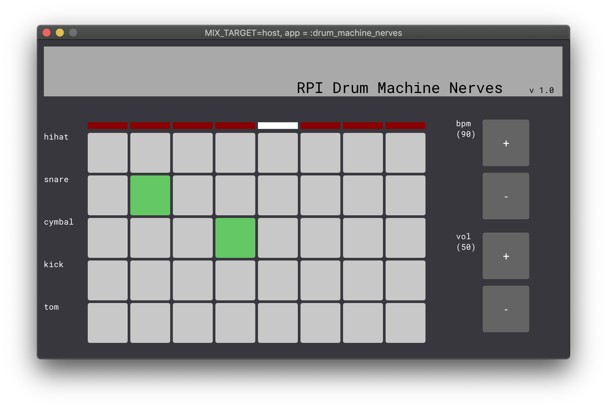
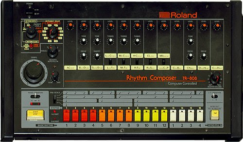

# How to Build a Drum Machine with Nerves

### Hassan Khan-Shaikley

Twitter: @hassanshaikley

Github: @hassanshaikley

---

# Me

- plants
- food
- milk tea
- tinkering
- spouse

---

# What is a Drum Machine

<!--  -->

---

# Hardware

- RPI3
- Official 7" Touchscreen
- Audio Jack Mic
- Power Supply
- Micro SD Card

---

# Software

- Nerves
- Scenic
- aplay (ships with scenic), afplay (local to mac)

---

# Meatware

- Yourself

---

# Getting Started

- Getting Started With Nerves in Scenic docs
- Plug and play

---

# Sound output to jack

`:os.cmd('amixer cset numid=3 1')`
- 0: automatic
- 1: analog (headphone jack)
- 2: HDMI
- 3: None 

---

# Changing volume

`:os.cmd('amixer cset numid=1 #{percent}%')`

---

# Using static assets

`priv/static` is accessed with `Path.join(:code.priv_dir(:drum_machine_nerves), "static")`

---

# Questions
