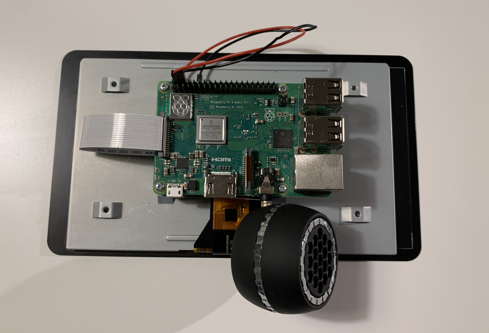
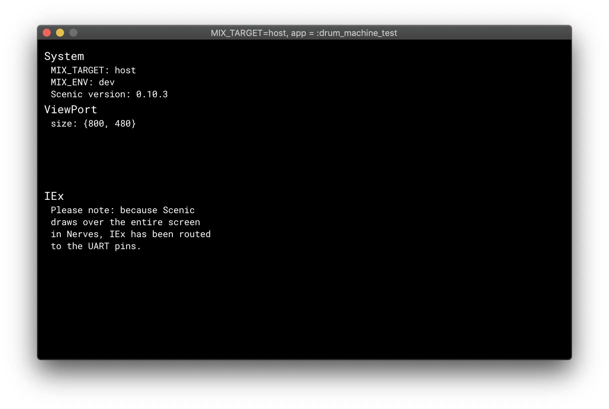

# How to Build a Drum Machine with Nerves

### Hassan Khan-Shaikley

Twitter: @hassanshaikley

Github: @hassanshaikley

---

## Me

- plants
- food
- milk tea
- tinkering
- spouse

---

## What is a Drum Machine

<!--  -->


---

## Hardware

- RPI3
- Official 7" Touchscreen
- Audio Jack Mic
- Power Supply
	- 5.25V / 3A 
- Micro SD Card

---



---

## Software

- Nerves
- Scenic
	- Supports cross platform compilation of UI
	- Has an RPI Driver
- aplay (ships with scenic), afplay (local to mac)

---

## Meatware

- Yourself

---

## Getting Started

- Getting Started With Nerves in Scenic docs
- Plug and play

---

## Initializing the project

0. Plug in your SD card
1. `mix scenic.new.nerves rpi_drum_machine_nerves`
2. `cd rpi_drum_machine_nerves`
3. `export MIX_TARGET=rpi3`
4. `mix deps.get`
5. `NERVES_SYSTEM=rpi3 mix firmware.burn` 

---



---

## Sound output to jack

`:os.cmd('amixer cset numid=3 1')`
- 0: automatic
- 1: analog (headphone jack)
- 2: HDMI
- 3: None 

---

## Changing volume

`:os.cmd('amixer cset numid=1 #{percent}%')`

---

## Using static assets

put wav files in `priv/static` 
accessible at `Path.join(:code.priv_dir(:rpi_drum_machine_nerves), "static")`

---

## Playing an audio file

`path_to_audio_file = Path.join([:code.priv_dir(Application.get_application(__MODULE__)), "static", file])`

`:os.cmd("aplay -q #{path_to_audio_file}")` 

---

## Scenic UI Example

```
block
o 
code
```

---

## Scenic click/touch handling example

- String matching!!!!
-

---

## Communicating between components 1/2

```
 def child_spec({args, opts}) do
   # name allows us to communicate via the name
   start_opts = [__MODULE__, args, Keyword.put_new(opts, :name, __MODULE__)]
   %{
     id: make_ref(),
     # important bit 👇
     start:
       {Scenic.Scene, :start_link, start_opts},
     type: :worker,
     restart: :permanent,
     shutdown: 500
   }
 end
```

---

## Communicating between components 2/2

```
alias RpiDrumMachineNerves.Components.VolumeControls

...

GenServer.cast(VolumeControls, {:update_volume, new_volume})
```
Then in that component
```
def handle_cast({:update_volume, new_volume}, state) do
```

---

## Optimize CPU usage

- Benchee
- Follow performance best practices
	- ie: Matching atoms is faster than strings
		- use atom id's
	- a <> b 3x faster than "#{a}#{b} 
		- Matching is 3x faster than <>
	- === barely faster than ==

---

## Optimize power consumption

- Disable what you don't need
	- ethernet
	- leds
	- usbs
	- https://github.com/cjfreeze/power_control is a great library for this

---

## Don't optimize memory

- Leverage memory to decrease CPU usage where you can
- RPI3A's have 512
	- Haven't run tests but still feels excessive
- RPI3B's have 1GB

---

## Source

github.com/hassanshaikley/rpi-drum-machine-nerves


---

## Questions

